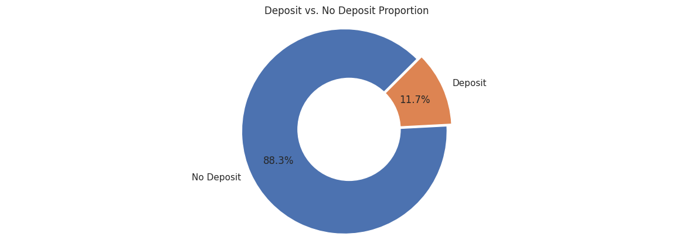
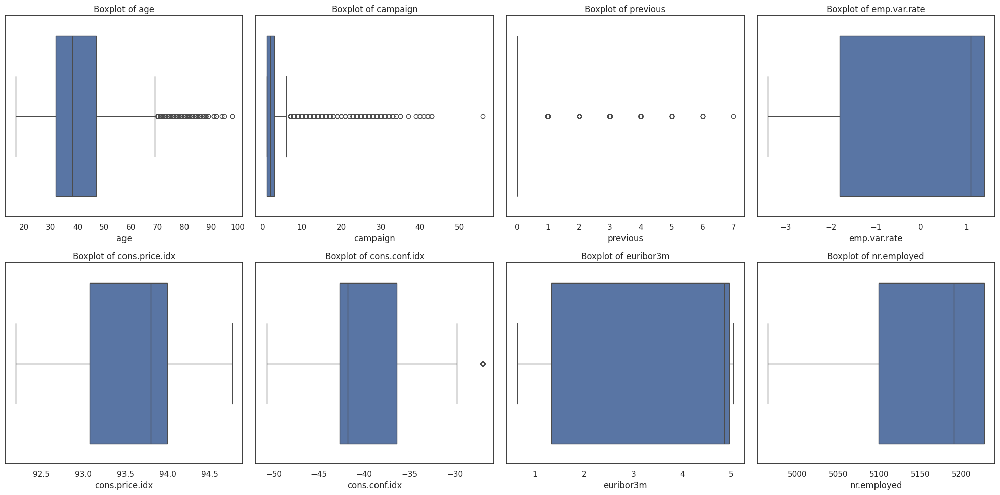
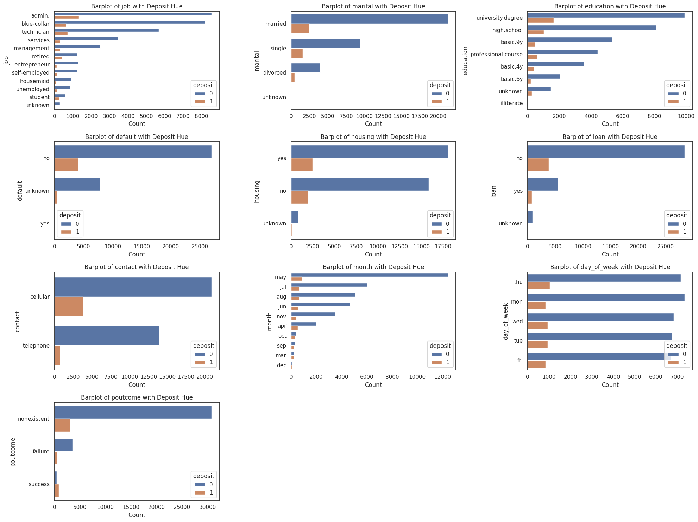
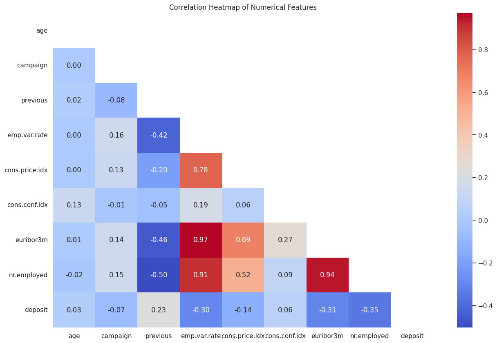
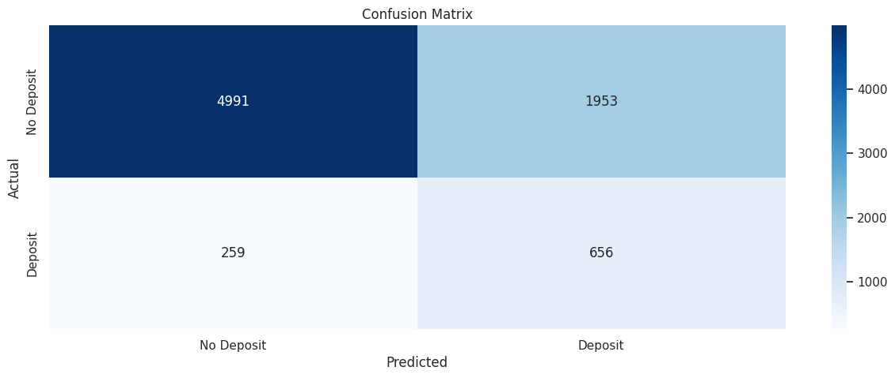
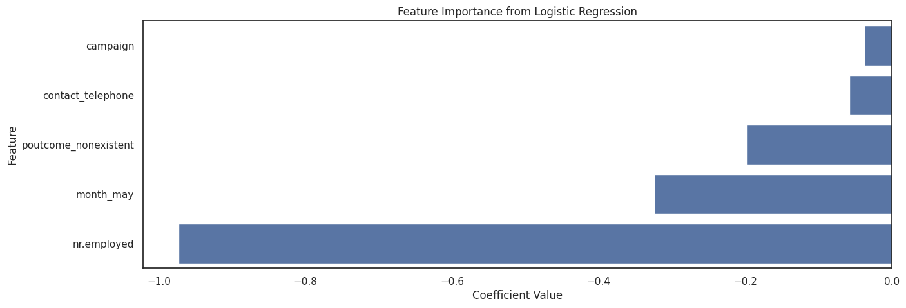

# **Laporan Proyek Machine Learning - Kevin Aditya Ikhsan**

## **Domain Project**  

Marketing campaigns play a crucial role in driving business growth, particularly in the financial industry. In this context, telemarketing, which involves contacting customers remotely through channels such as telephone calls, has been a widely adopted approach. However, outbound telemarketing often faces challenges, such as high costs and intrusiveness, which can negatively impact customer relationships [[1]](https://repositorium.sdum.uminho.pt/bitstream/1822/30994/1/dss-v3.pdf). Each call incurs an estimated cost of €5 [[2]](https://www.maestroqa.com/blog/call-center-cost-per-call), making it essential to optimize targeting strategies to ensure that only customers with the highest likelihood of success are contacted. Furthermore, considering a minimum deposit requirement of €5,000 [[3]](https://www.bancomontepio.pt/en/individuals/savings-and-retirement/term-deposits) and an average Net Interest Margin (NIM) of 1.25% in Portugal [[4]](https://www.theglobaleconomy.com/Portugal/net_interest_margin/), successful calls represent significant revenue opportunities, generating an estimated net revenue of €62.50 per deposit annually. 

This project proposes a machine learning-driven solution to enhance the effectiveness of telemarketing campaigns by predicting the likelihood of a successful long-term deposit subscription. By leveraging machine learning models, the system aims to analyze customer data and prioritize individuals with higher conversion probabilities, thereby reducing campaign costs and improving efficiency. This approach enables banks to focus resources on high-potential leads, minimizing unnecessary calls while maximizing revenue opportunities and maintaining better customer relationships.

## **Business Understanding**

### **Problem Statements**

1. **High Costs and Inefficiency:** Outbound telemarketing incurs significant costs (€5 per call) and inefficiency due to a lack of accurate targeting, leading to wasted resources and potential customer dissatisfaction.  
2. **Maximizing Revenue Opportunities:** The need to identify high-potential customers to maximize revenue from long-term deposits (€62.50 per successful deposit annually) remains unaddressed.  

### **Goals**

1. **Optimize Telemarketing Costs:** Reduce the number of unnecessary calls by accurately predicting the likelihood of success for each customer.  
2. **Increase Revenue Efficiency:** Improve the overall return on investment by prioritizing calls to high-potential customers, ensuring higher conversion rates.

### **Solution Statements**

1. **Machine Learning Model Development:** Implement and compare machine learning algorithms, such as Logistic Regression, KNN, Naive Bayes, Decision Tree, and Ensemble Methods, to predict customer conversion probabilities.  
2. **Hyperparameter Tuning:** Enhance the performance of the chosen baseline model through systematic hyperparameter optimization.  
3. **Evaluation Metrics:** Use **recall** to ensure high identification of potential customers and calculate business metrics (e.g., cost savings and revenue gains) to assess the economic impact of the solution.
4. **Feature Importance Analysis:** Perform feature importance analysis to identify the most impactful factors influencing customer conversions, enabling more informed decision-making.

## **Data Understanding**

This project utilizes the **Bank Marketing Campaigns Dataset** [[5]](https://www.kaggle.com/datasets/volodymyrgavrysh/bank-marketing-campaigns-dataset), which captures the results of marketing campaigns conducted by a bank in Portugal. These campaigns primarily involved direct phone calls to clients, promoting term deposit subscriptions. The target, **`y`**, indicates whether a client subscribed to a term deposit ("yes" or "no").

### **Dataset Features**  
The dataset contains 21 features categorized into different types based on their relevance:

1. **Bank Client Data**:
   - **`age`**: Age of the client (numeric).
   - **`job`**: Type of job (categorical: e.g., "admin.", "blue-collar", "entrepreneur", "unknown").
   - **`marital`**: Marital status (categorical: e.g., "single", "married", "divorced", "unknown").
   - **`education`**: Education level (categorical: e.g., "university.degree", "high.school", "unknown").
   - **`default`**: Credit default status (categorical: "yes", "no", "unknown").
   - **`housing`**: Housing loan status (categorical: "yes", "no", "unknown").
   - **`loan`**: Personal loan status (categorical: "yes", "no", "unknown").

2. **Last Contact Data**:
   - **`contact`**: Communication type (categorical: "cellular", "telephone").
   - **`month`**: Last contact month (categorical: e.g., "jan", "feb", "dec").
   - **`day_of_week`**: Last contact day (categorical: "mon", "tue", "fri").
   - **`duration`**: Last contact duration in seconds (numeric). (Note: For realistic predictive models, this feature is excluded as it’s only known after the call.)

3. **Campaign Data**:
   - **`campaign`**: Number of contacts made during the campaign (numeric).
   - **`pdays`**: Days since last client contact in a previous campaign (numeric; 999 indicates no prior contact).
   - **`previous`**: Number of contacts before the current campaign (numeric).
   - **`poutcome`**: Outcome of the previous campaign (categorical: "success", "failure", "nonexistent").

4. **Social and Economic Context**:
   - **`emp.var.rate`**: Employment variation rate (numeric).
   - **`cons.price.idx`**: Consumer price index (numeric).
   - **`cons.conf.idx`**: Consumer confidence index (numeric).
   - **`euribor3m`**: Euribor 3-month rate (numeric).
   - **`nr.employed`**: Number of employees (numeric).

5. **Target**:
   - **`y`**: Whether the client subscribed to a term deposit (binary: "yes", "no").

### **Handling Missing Values**  
Missing values in categorical features, denoted as "unknown," will be addressed through appropriate imputation techniques or treated as a separate class if relevant to the analysis.

### **Exploratory Data Analysis**  

The dataset was preprocessed by renaming the 'y' column to 'deposit' and converting its values from categorical ('yes', 'no') to numerical (1, 0). The 'duration' feature, which represents the last contact duration in seconds, was removed as it is only known after the call and could introduce data leakage, making it unsuitable for realistic predictive models.



The visualization reveals a significant imbalance in the dataset, with 88.3% of clients not making a deposit, compared to only 11.7% who did. This suggests that the majority of clients in the dataset did not engage in the desired action, which may influence model training, potentially leading to a bias towards predicting 'no deposit.' This distribution should be considered when building and evaluating predictive models to account for the class imbalance. Further, exploratory data analysis will be performed to numerical and categorical features.

### **Numerical Features**

  <div id="df-e41d0a79-2d4a-4d59-915f-0a731592269d" class="colab-df-container">
    <div>
<style scoped>
    .dataframe tbody tr th:only-of-type {
        vertical-align: middle;
    }

    .dataframe tbody tr th {
        vertical-align: top;
    }

    .dataframe thead th {
        text-align: right;
    }
</style>
<table border="1" class="dataframe">
  <thead>
    <tr style="text-align: right;">
      <th></th>
      <th>Feature</th>
      <th>Type</th>
      <th>Null</th>
      <th>Min</th>
      <th>Q1</th>
      <th>Median</th>
      <th>Q3</th>
      <th>Max</th>
    </tr>
  </thead>
  <tbody>
    <tr>
      <th>0</th>
      <td>age</td>
      <td>int64</td>
      <td>0</td>
      <td>17</td>
      <td>32.0</td>
      <td>38.0</td>
      <td>47.0</td>
      <td>98</td>
    </tr>
    <tr>
      <th>1</th>
      <td>campaign</td>
      <td>int64</td>
      <td>0</td>
      <td>1</td>
      <td>1.0</td>
      <td>2.0</td>
      <td>3.0</td>
      <td>56</td>
    </tr>
    <tr>
      <th>2</th>
      <td>pdays</td>
      <td>int64</td>
      <td>0</td>
      <td>0</td>
      <td>999.0</td>
      <td>999.0</td>
      <td>999.0</td>
      <td>999</td>
    </tr>
    <tr>
      <th>3</th>
      <td>previous</td>
      <td>int64</td>
      <td>0</td>
      <td>0</td>
      <td>0.0</td>
      <td>0.0</td>
      <td>0.0</td>
      <td>7</td>
    </tr>
    <tr>
      <th>4</th>
      <td>emp.var.rate</td>
      <td>float64</td>
      <td>0</td>
      <td>-3.4</td>
      <td>-1.8</td>
      <td>1.1</td>
      <td>1.4</td>
      <td>1.4</td>
    </tr>
    <tr>
      <th>5</th>
      <td>cons.price.idx</td>
      <td>float64</td>
      <td>0</td>
      <td>92.201</td>
      <td>93.075</td>
      <td>93.798</td>
      <td>93.994</td>
      <td>94.767</td>
    </tr>
    <tr>
      <th>6</th>
      <td>cons.conf.idx</td>
      <td>float64</td>
      <td>0</td>
      <td>-50.8</td>
      <td>-42.7</td>
      <td>-41.8</td>
      <td>-36.4</td>
      <td>-26.9</td>
    </tr>
    <tr>
      <th>7</th>
      <td>euribor3m</td>
      <td>float64</td>
      <td>0</td>
      <td>0.634</td>
      <td>1.334</td>
      <td>4.857</td>
      <td>4.961</td>
      <td>5.045</td>
    </tr>
    <tr>
      <th>8</th>
      <td>nr.employed</td>
      <td>float64</td>
      <td>0</td>
      <td>4963.6</td>
      <td>5099.1</td>
      <td>5191.0</td>
      <td>5228.1</td>
      <td>5228.1</td>
    </tr>
    <tr>
      <th>9</th>
      <td>deposit</td>
      <td>int64</td>
      <td>0</td>
      <td>0</td>
      <td>0.0</td>
      <td>0.0</td>
      <td>0.0</td>
      <td>1</td>
    </tr>
  </tbody>
</table>
</div>
  
The dataset contains some numerical features with null values. In the 'pdays' feature, which represents the number of days since the client was last contacted during a previous campaign, the minimum value is zero, while the Q1, median, Q3, and maximum are all 999. This suggests that most clients were not previously contacted. This observation aligns with the 'previous' feature, which indicates the number of contacts made before this campaign, where the maximum value is 7, but the minimum, Q1, median, and Q3 values are all zero. We will further investigate the 'pdays' and 'previous' features to better understand the data. Additionally, we will examine the 'campaign' feature, which represents the number of contacts made during this campaign, as there is a significant jump between Q3 (3 contacts) and the maximum (56 contacts), indicating potential anomalies or outliers.

<div>
<style scoped>
    .dataframe tbody tr th:only-of-type {
        vertical-align: middle;
    }

    .dataframe tbody tr th {
        vertical-align: top;
    }

    .dataframe thead th {
        text-align: right;
    }
</style>
<table border="1" class="dataframe">
  <thead>
    <tr style="text-align: right;">
      <th></th>
      <th>proportion</th>
    </tr>
    <tr>
      <th>pdays</th>
      <th></th>
    </tr>
  </thead>
  <tbody>
    <tr>
      <th>999</th>
      <td>96.16</td>
    </tr>
    <tr>
      <th>3</th>
      <td>1.11</td>
    </tr>
    <tr>
      <th>6</th>
      <td>1.05</td>
    </tr>
    <tr>
      <th>4</th>
      <td>0.30</td>
    </tr>
    <tr>
      <th>9</th>
      <td>0.16</td>
    </tr>
  </tbody>
</table>

The proportion of values in the 'pdays' feature indicates that 96.16% of the entries are 999, suggesting that most clients were not contacted in previous campaigns. Given that 'pdays' represents the number of days since the last contact, and the value 999 is used when a client has never been contacted, there is no appropriate method to fill in these values for clients who were never contacted. Therefore, the 'pdays' feature will be dropped from the dataset.

<div>
<style scoped>
    .dataframe tbody tr th:only-of-type {
        vertical-align: middle;
    }

    .dataframe tbody tr th {
        vertical-align: top;
    }

    .dataframe thead th {
        text-align: right;
    }
</style>
<table border="1" class="dataframe">
  <thead>
    <tr style="text-align: right;">
      <th></th>
      <th>proportion</th>
    </tr>
    <tr>
      <th>previous</th>
      <th></th>
    </tr>
  </thead>
  <tbody>
    <tr>
      <th>0</th>
      <td>85.95</td>
    </tr>
    <tr>
      <th>1</th>
      <td>11.37</td>
    </tr>
    <tr>
      <th>2</th>
      <td>1.90</td>
    </tr>
    <tr>
      <th>3</th>
      <td>0.54</td>
    </tr>
    <tr>
      <th>4</th>
      <td>0.18</td>
    </tr>
  </tbody>
</table>

The 'previous' feature shows that 85.95% of the entries are 0, indicating that the majority of clients were never contacted in previous campaigns. Other values represent a small proportion of the data, reflecting clients who were contacted once or more. Given that the value 0 is valid for clients who were not previously contacted, and dropping this feature may result in the loss of valuable information about clients' interaction history with previous campaigns, the 'previous' feature will be retained in the dataset.



As anticipated, outliers were identified in the 'campaign' and other features, as visualized through boxplots. These outliers will not be removed or replaced, as they may contain valuable information for identifying patterns in clients likely to make a deposit. Instead, a robust scaler will be applied during data preparation to handle the outliers effectively. The number and percentage of outliers detected will be presented bellow.

Feature: age, Outlier: 458 (1.16%) <br>
Feature: campaign, Outlier: 2398 (6.09%) <br>
Feature: previous, Outlier: 5535 (14.05%) <br>
Feature: cons.conf.idx, Outlier: 436 (1.11%) <br>

### **Categorical Features**

  <div id="df-e47daa1f-08e8-492f-9071-34851e03cb04" class="colab-df-container">
    <div>
<style scoped>
    .dataframe tbody tr th:only-of-type {
        vertical-align: middle;
    }

    .dataframe tbody tr th {
        vertical-align: top;
    }

    .dataframe thead th {
        text-align: right;
    }
</style>
<table border="1" class="dataframe">
  <thead>
    <tr style="text-align: right;">
      <th></th>
      <th>Feature</th>
      <th>Type</th>
      <th>Null</th>
      <th>Unique</th>
      <th>Unique Values</th>
    </tr>
  </thead>
  <tbody>
    <tr>
      <th>0</th>
      <td>job</td>
      <td>object</td>
      <td>0</td>
      <td>12</td>
      <td>[housemaid, services, admin., blue-collar, technician, retired, management, unemployed, self-employed, unknown, entrepreneur, student]</td>
    </tr>
    <tr>
      <th>1</th>
      <td>marital</td>
      <td>object</td>
      <td>0</td>
      <td>4</td>
      <td>[married, single, divorced, unknown]</td>
    </tr>
    <tr>
      <th>2</th>
      <td>education</td>
      <td>object</td>
      <td>0</td>
      <td>8</td>
      <td>[basic.4y, high.school, basic.6y, basic.9y, professional.course, unknown, university.degree, illiterate]</td>
    </tr>
    <tr>
      <th>3</th>
      <td>default</td>
      <td>object</td>
      <td>0</td>
      <td>3</td>
      <td>[no, unknown, yes]</td>
    </tr>
    <tr>
      <th>4</th>
      <td>housing</td>
      <td>object</td>
      <td>0</td>
      <td>3</td>
      <td>[no, yes, unknown]</td>
    </tr>
    <tr>
      <th>5</th>
      <td>loan</td>
      <td>object</td>
      <td>0</td>
      <td>3</td>
      <td>[no, yes, unknown]</td>
    </tr>
    <tr>
      <th>6</th>
      <td>contact</td>
      <td>object</td>
      <td>0</td>
      <td>2</td>
      <td>[telephone, cellular]</td>
    </tr>
    <tr>
      <th>7</th>
      <td>month</td>
      <td>object</td>
      <td>0</td>
      <td>10</td>
      <td>[may, jun, jul, aug, oct, nov, dec, mar, apr, sep]</td>
    </tr>
    <tr>
      <th>8</th>
      <td>day_of_week</td>
      <td>object</td>
      <td>0</td>
      <td>5</td>
      <td>[mon, tue, wed, thu, fri]</td>
    </tr>
    <tr>
      <th>9</th>
      <td>poutcome</td>
      <td>object</td>
      <td>0</td>
      <td>3</td>
      <td>[nonexistent, failure, success]</td>
    </tr>
  </tbody>
</table>
</div>

As previously mentioned, some categorical features contain missing values, denoted as "unknown." We will first analyze their distribution before deciding whether to handle them using appropriate imputation techniques or treat "unknown" as a separate class. From the 'contact' feature, we observe that the communication type is either 'telephone' or 'cellular.' The 'month' feature reveals that no campaigns were conducted in January or February, while the 'day_of_week' feature indicates that campaigns were only conducted on weekdays. Additionally, since most clients were not contacted in previous campaigns, we expect the majority of 'poutcome' (outcome of the previous marketing campaign) entries to be 'nonexistent.'



The distribution of categorical features, visualized using bar plots, reveals that some features contain a small proportion of missing values, denoted as "unknown." If the proportion of "unknown" in a feature is negligible, such as in the 'marital' feature, rows with "unknown" will be removed. Additionally, categories with very few samples, such as 'illiterate' in the 'education' feature and 'yes' in the 'default' feature, will be dropped. This approach helps reduce cardinality, particularly in feature with a high number of unique values, thereby simplifying the dataset and enhancing model performance. Those feature will be checked first before dropped.


  <div id="df-f89a8581-afcf-4755-9d6f-f3bb4a04205f" class="colab-df-container">
    <div>
<style scoped>
    .dataframe tbody tr th:only-of-type {
        vertical-align: middle;
    }

    .dataframe tbody tr th {
        vertical-align: top;
    }

    .dataframe thead th {
        text-align: right;
    }
</style>
<table border="1" class="dataframe">
  <thead>
    <tr style="text-align: right;">
      <th></th>
      <th>Unknown Count</th>
      <th>Percentage</th>
    </tr>
  </thead>
  <tbody>
    <tr>
      <th>job</th>
      <td>325</td>
      <td>0.83</td>
    </tr>
    <tr>
      <th>marital</th>
      <td>78</td>
      <td>0.20</td>
    </tr>
    <tr>
      <th>education</th>
      <td>1685</td>
      <td>4.28</td>
    </tr>
    <tr>
      <th>default</th>
      <td>8265</td>
      <td>20.98</td>
    </tr>
    <tr>
      <th>housing</th>
      <td>980</td>
      <td>2.49</td>
    </tr>
    <tr>
      <th>loan</th>
      <td>980</td>
      <td>2.49</td>
    </tr>
  </tbody>
</table>
</div>

<div>
<style scoped>
    .dataframe tbody tr th:only-of-type {
        vertical-align: middle;
    }

    .dataframe tbody tr th {
        vertical-align: top;
    }

    .dataframe thead th {
        text-align: right;
    }
</style>
<table border="1" class="dataframe">
  <thead>
    <tr style="text-align: right;">
      <th></th>
      <th>count</th>
    </tr>
    <tr>
      <th>education</th>
      <th></th>
    </tr>
  </thead>
  <tbody>
    <tr>
      <th>university.degree</th>
      <td>11555</td>
    </tr>
    <tr>
      <th>high.school</th>
      <td>9119</td>
    </tr>
    <tr>
      <th>basic.9y</th>
      <td>5784</td>
    </tr>
    <tr>
      <th>professional.course</th>
      <td>5017</td>
    </tr>
    <tr>
      <th>basic.4y</th>
      <td>3993</td>
    </tr>
    <tr>
      <th>basic.6y</th>
      <td>2222</td>
    </tr>
    <tr>
      <th>unknown</th>
      <td>1685</td>
    </tr>
    <tr>
      <th>illiterate</th>
      <td>18</td>
    </tr>
  </tbody>
</table>

<div>
<style scoped>
    .dataframe tbody tr th:only-of-type {
        vertical-align: middle;
    }

    .dataframe tbody tr th {
        vertical-align: top;
    }

    .dataframe thead th {
        text-align: right;
    }
</style>
<table border="1" class="dataframe">
  <thead>
    <tr style="text-align: right;">
      <th></th>
      <th>count</th>
    </tr>
    <tr>
      <th>default</th>
      <th></th>
    </tr>
  </thead>
  <tbody>
    <tr>
      <th>no</th>
      <td>31125</td>
    </tr>
    <tr>
      <th>unknown</th>
      <td>8265</td>
    </tr>
    <tr>
      <th>yes</th>
      <td>3</td>
    </tr>
  </tbody>
</table>

After analyzing all features containing "unknown" values, it was confirmed that the 'marital' feature has a very small number of "unknown" entries, with only 78 samples. Additionally, there are only 18 clients classified as 'illiterate' in the 'education' feature and 3 clients with 'yes' in the 'default' feature. Given the minimal representation of these categories, they will be removed from their respective features. However, the "unknown" category in other features will not be dropped and will instead be treated as a separate class.

### **Features Correlation**



A heatmap analysis revealed that 'nr.employed' is highly correlated with 'emp.var.rate' and 'euribor3m,' with a correlation magnitude greater than 0.90. Among these, 'nr.employed' has the strongest correlation with the target variable, 'deposit.' Therefore, we can expect the model to perform similarly when selecting 'nr.employed' as the representative feature among the three. In contrast, features such as 'age,' 'campaign,' and 'cons.conf.idx' show little to no correlation with 'deposit.'

## **Data Preparation**

### **Split Dataset**

```python
# Separate features and target variable.
X = df.drop(['deposit'], axis=1)
y = df['deposit']
```

The target variable, 'deposit,' is separated from the features in the dataset. The features are stored in the variable `X`, while the target variable is stored in `y`. This separation is essential because, in machine learning, the model needs to learn from the features (input data) to predict the target (output data).

The data preparation stage is necessary for several reasons:
1. **Feature-Target Separation**: By separating the features and target variable, we can train the model to predict 'deposit' based on the values in `X`.
2. **Data Preprocessing**: It allows for easier preprocessing of the features (e.g., scaling and encoding) before training the model.
3. **Model Training**: It ensures that the model only learns from the input data (features) and not the target variable, preventing data leakage and improving the model's generalization capabilities.

This step is a fundamental part of the workflow to prepare the data for further modeling and analysis.

```python
# Separate train and test set.
X_train, X_test, y_train, y_test = train_test_split(
    X,
    y,
    test_size=0.2,
    stratify=y,
    random_state=42
)
```

The dataset is split into training and testing sets using the `train_test_split` function. The features (`X`) and target variable (`y`) are divided into `X_train`, `X_test`, `y_train`, and `y_test`. This ensures that the model is trained on one portion of the data (`X_train`, `y_train`) and evaluated on another portion (`X_test`, `y_test`), helping to assess its performance on unseen data.

The key parameters used in this split are:
- **test_size=0.2**: This indicates that 20% of the data is reserved for testing, while 80% is used for training.
- **stratify=y**: This ensures that the distribution of the target variable, 'deposit,' is preserved in both the training and testing sets, leading to a more balanced split and reducing bias in the model.
- **random_state=42**: This is a fixed seed for reproducibility, ensuring that the split is consistent across different runs of the code.

This step is crucial because it allows for a fair evaluation of the model's performance, preventing overfitting and ensuring that the model generalizes well to new data.

### **Scale Numerical Features**

```python
# Select only numerical features.
num_cols = X_train.select_dtypes(include=np.number).columns

# Scale numerical features.
scaler = RobustScaler()
X_train_scaled = pd.DataFrame(scaler.fit_transform(X_train[num_cols]), columns=num_cols)
X_test_scaled = pd.DataFrame(scaler.transform(X_test[num_cols]), columns=num_cols)
```

The **RobustScaler** is applied to scale the numerical features. This scaler is particularly useful when dealing with outliers, as it scales the data based on the median and the interquartile range, making it more robust to extreme values.

The scaling process is performed as follows:
- **fit_transform**: The `fit_transform` method is applied to the training data (`X_train[num_cols]`) to compute the scaling parameters (median and interquartile range) and then transform the data.
- **transform**: The `transform` method is applied to the test data (`X_test[num_cols]`) using the scaling parameters computed from the training data. This ensures that the test data is scaled consistently with the training data.

This data scaling is crucial because many machine learning algorithms perform better when the data is on a similar scale, preventing features with larger values from disproportionately influencing the model. By using **RobustScaler**, the model is made more resilient to the impact of outliers, helping improve its performance and stability.

### **Encode Categorical Features**

```python
# Select only categorical features.
cat_cols = X_train.select_dtypes(include='object').columns

# Encode categorical fetures.
encoder = OneHotEncoder(drop='first')
X_train_encoded = pd.DataFrame(encoder.fit_transform(X_train[cat_cols]).toarray(), columns=encoder.get_feature_names_out())
X_test_encoded = pd.DataFrame(encoder.transform(X_test[cat_cols]).toarray(), columns=encoder.get_feature_names_out())
```

The **OneHotEncoder** is  applied to convert categorical variables into a format suitable for machine learning algorithms. The key parameter used is:
- **drop='first'**: This parameter ensures that one category for each categorical feature is dropped to avoid multicollinearity (also known as the "dummy variable trap"). By dropping the first category, we create binary columns for the remaining categories, with each column indicating whether the sample belongs to that category.

The encoding process is performed as follows:
- **fit_transform**: The `fit_transform` method is applied to the training data (`X_train[cat_cols]`) to learn the encoding and transform the categorical features into numerical format. The result is a sparse matrix, which is then converted into a dense array using `toarray()`.
- **transform**: The `transform` method is applied to the test data (`X_test[cat_cols]`) using the learned encoding from the training data. This ensures the test data is encoded in the same way as the training data.

The encoded features are stored in `X_train_encoded` and `X_test_encoded`, with appropriate column names generated by `get_feature_names_out()`.

This encoding step is important because machine learning algorithms typically require numerical input, and categorical variables need to be represented in a format that models can interpret. One-hot encoding ensures that categorical features are properly handled without imposing any ordinal relationship between them, which is essential for most models.

```python
# Combined the scaled numerical features and the encoded categorical features.
X_train = pd.concat([X_train_scaled, X_train_encoded], axis=1)
X_test = pd.concat([X_test_scaled, X_test_encoded], axis=1)
```

## **Modeling**

### **Models Benchmarking**

```python
# Define a dictionary of models.
models = {
    'Logistic Regression': LogisticRegression(class_weight='balanced'),
    'Naive Bayes': GaussianNB(),
    'KNN': KNeighborsClassifier(),
    'Decision Tree': DecisionTreeClassifier(class_weight='balanced', random_state=42),
    'Random Forest': RandomForestClassifier(class_weight='balanced', random_state=42),
    'AdaBoost': AdaBoostClassifier(random_state=42),
    'Gradient Boosting': GradientBoostingClassifier(random_state=42),
    'XGBoost': XGBClassifier(random_state=42)
}
```

A dictionary of machine learning models is defined, where each key represents the name of the model, and the value is the corresponding model object. The models included are:

1. **Logistic Regression**: This model is used for binary classification problems. It is configured with the `class_weight='balanced'` parameter to address potential class imbalance by adjusting the weights inversely proportional to class frequencies.
2. **Naive Bayes**: This probabilistic classifier is based on Bayes' theorem and assumes that the features are independent given the class. It is often used for classification tasks and is simple and fast.
3. **K-Nearest Neighbors (KNN)**: This non-parametric method is used for classification by finding the majority class among the nearest neighbors. It is sensitive to the choice of the number of neighbors (k) and distance metrics.
4. **Decision Tree**: This model makes decisions based on a tree-like structure and is useful for both classification and regression. The `class_weight='balanced'` parameter ensures that the model handles class imbalance by assigning weights to classes based on their frequencies.
5. **Random Forest**: An ensemble method that builds multiple decision trees and aggregates their predictions. The `class_weight='balanced'` parameter helps address class imbalance.
6. **AdaBoost**: A boosting algorithm that combines weak classifiers to create a strong classifier. It focuses on misclassified instances in subsequent iterations, improving performance.
7. **Gradient Boosting**: This boosting algorithm sequentially builds trees, where each tree corrects the errors of the previous one. It is known for its high performance but can be prone to overfitting if not tuned properly.
8. **XGBoost**: An optimized version of gradient boosting, designed to improve speed and performance. It is highly effective for large datasets and has become a popular choice for machine learning competitions.

Each model is initialized with specific parameters:
- **class_weight='balanced'** for models like Logistic Regression, Decision Tree, and Random Forest to help with class imbalance.
- **random_state=42** is set for reproducibility of results.

These models will be evaluated to identify the best one for solving the classification problem at hand.

```python
results = []

# Split train set for cross-validation.
skf = StratifiedKFold(n_splits=5, shuffle=True, random_state=42)

# Evaluate model's performance on recall.
for model in models.values():
    recall_scores = cross_val_score(
        model,
        X_train,
        y_train,
        scoring='recall',
        cv=skf
    )
    results.append(recall_scores.tolist())
```

**StratifiedKFold** cross-validation is used to evaluate the models in the dictionary. The **StratifiedKFold** is initialized with `n_splits=5`, meaning the dataset will be split into 5 subsets (folds) for cross-validation. The `shuffle=True` parameter ensures that the data is shuffled before splitting, and `random_state=42` ensures reproducibility.

The models are evaluated using **cross_val_score** with the following parameters:
- **model**: Each model in the dictionary will be evaluated.
- **X_train** and **y_train**: The training data and target variable are used for the evaluation.
- **scoring='recall'**: The evaluation metric is recall, which measures the model's ability to correctly identify positive cases (i.e., clients who will make a deposit). Recall is a crucial metric in imbalanced classification problems.
- **cv=skf**: StratifiedKFold is used as the cross-validation strategy to ensure that each fold has a similar distribution of target classes.

The recall scores for each model are computed and stored in the **results** list, which contains the recall scores for each fold of each model.

This process is important because it allows for a fair comparison of the models' performance on the recall metric, considering class imbalance and ensuring that the models generalize well across different subsets of the data.


Boxplot show that **Logistic Regression** has the highest and most stable recall score compared to other models. This indicates that Logistic Regression is the best model for this task, based on recall performance.
Logistic Regression likely performs well in identifying clients who will make a deposit, which is critical for this imbalanced classification problem.

### **Logistic Regression**

**Logistic Regression** is a statistical model used for binary classification tasks, where the goal is to predict one of two possible outcomes (e.g., "yes" or "no", "deposit" or "no deposit"). It models the relationship between the dependent variable (target) and one or more independent variables (features) by estimating probabilities using a logistic function.

In the case of binary classification, the logistic function, also known as the **sigmoid function**, is used to model the probability of the positive class. The logistic regression model outputs probabilities between 0 and 1, which are then mapped to either class based on a chosen threshold (typically 0.5).

The logistic regression equation can be written as:

$$P(y = 1 | X) = \frac{1}{1 + e^{-z}}$$

Where:
- $P(y = 1 | X)$ is the probability that the outcome is 1 (positive class).
- $z$ is the linear combination of the input features: $z = \beta_0 + \beta_1 X_1 + \beta_2 X_2 + ... + \beta_n X_n$.
- $e$ is Euler's number (approximately 2.71828).

The goal of logistic regression is to estimate the coefficients $\beta_0, \beta_1, \dots, \beta_n$ that minimize the error between the predicted probabilities and the actual outcomes. This is typically done using **maximum likelihood estimation (MLE)**.

### **Hyperparameter Tuning**

Logistic regression has several hyperparameters that can be tuned to improve the model's performance. Hyperparameter tuning performed using **GridSearchCV** to find the best combination of hyperparameters. The key hyperparameters for logistic regression are as follows:

1. **C** (Regularization Strength):
   - **Definition**: C is the inverse of regularization strength. Smaller values of C correspond to stronger regularization.
   - **Effect**: Regularization helps prevent overfitting by penalizing large coefficients. When C is small, the model places more emphasis on regularization (leading to a simpler model with fewer large weights), while larger values of C result in less regularization and a more complex model that may overfit.
   - **Tuning**: The values of C were varied in the range from 0.001 to 100 to find the optimal balance between bias and variance.

2. **Penalty** (Regularization Type):
   - **Definition**: This hyperparameter specifies the type of regularization to apply. Logistic regression supports two types:
     - `'l1'` (Lasso Regularization): L1 regularization encourages sparsity in the coefficients (some coefficients may be driven to zero).
     - `'l2'` (Ridge Regularization): L2 regularization penalizes the sum of squared coefficients but does not drive any coefficients exactly to zero.
   - **Effect**: L1 regularization can be used for feature selection, as it can set some coefficients to zero. L2 regularization tends to shrink the coefficients towards zero but does not eliminate them completely.
   - **Tuning**: Both `'l1'` and `'l2'` were tested to determine which regularization type worked best for the dataset.

3. **Solver** (Optimization Algorithm):
   - **Definition**: The solver specifies the optimization algorithm used to find the coefficients. Logistic regression supports several solvers, but two were considered here:
     - `'liblinear'`: A solver that is efficient for small datasets and works well with both L1 and L2 regularization.
     - `'saga'`: A solver that is more scalable and works well for larger datasets, particularly when using L1 regularization.
   - **Effect**: The solver determines how the model's coefficients are optimized during training. The choice of solver can impact both the model's performance and training speed.
   - **Tuning**: We tested both `'liblinear'` and `'saga'` to compare their performance and efficiency.

```python
# Define the parameter grid for Logistic Regression.
param_grid = {
    'C': [0.001, 0.01, 0.1, 1, 10, 100],
    'penalty': ['l1', 'l2'],
    'solver': ['liblinear', 'saga']
}

# Create a Logistic Regression model.
lr = LogisticRegression(class_weight='balanced', random_state=42)

# Create a GridSearchCV object.
grid_search = GridSearchCV(
    estimator=lr,
    param_grid=param_grid,
    scoring='recall',
    cv=skf,
    n_jobs=-1
)


# Fit the GridSearchCV object to the training data.
grid_search.fit(X_train, y_train)

# Print the best hyperparameters and the corresponding recall score.
print(f"Best hyperparameters: {grid_search.best_params_}")
print(f"Best cross-validation recall score: {grid_search.best_score_:.4f}")

# Evaluate the best model on the test set.
best_lr = grid_search.best_estimator_
y_pred = best_lr.predict(X_test)
test_recall = recall_score(y_test, y_pred)
print(f"Test set recall score: {test_recall:.4f}")
```

Best hyperparameters: {'C': 0.001, 'penalty': 'l1', 'solver': 'liblinear'} <br>
Best cross-validation recall score: 0.7089 <br>
Test set recall score: 0.7169 <br>

**Hyperparameter tuning** is performed using **GridSearchCV** to optimize the Logistic Regression model for the recall metric.

1. **Define the Parameter Grid**
   - A dictionary `param_grid` is created to define the hyperparameters to be tuned:
     - **C**: The regularization strength. A smaller value indicates stronger regularization.
     - **penalty**: Specifies the regularization method. `'l1'` is Lasso regularization (L1), and `'l2'` is Ridge regularization (L2).
     - **solver**: The optimization algorithm to be used. `'liblinear'` is suitable for small datasets, and `'saga'` is more efficient for larger datasets.

2. **Create a Logistic Regression Model**
   - A Logistic Regression model is initialized with `class_weight='balanced'` to handle class imbalance, and `random_state=42` for reproducibility.

3. **GridSearchCV**
   - `GridSearchCV` is created with the following parameters:
     - **estimator=lr**: The Logistic Regression model.
     - **param_grid=param_grid**: The parameter grid to search over.
     - **scoring=recall_scorer**: The scoring metric, which is recall, to evaluate the performance of different hyperparameter combinations.
     - **cv=skf**: Stratified K-fold cross-validation to ensure a balanced split of the target variable.
     - **n_jobs=-1**: Uses all available CPU cores to speed up the search.

4. **Fit GridSearchCV**
   - The `fit` method is called to search over the hyperparameter grid and find the best combination based on recall score.

5. **Output Best Hyperparameters and Score**
   - The best hyperparameters (`best_params_`) and the best cross-validation recall score (`best_score_`) are printed.
   
6. **Evaluate the Best Model on the Test Set**
   - The best model found through GridSearchCV (`best_lr`) is used to predict the target values for the test set.
   - The recall score on the test set is calculated and printed.

**Output Interpretation**
- **Best hyperparameters**: `{'C': 0.001, 'penalty': 'l1', 'solver': 'liblinear'}`: The best combination of hyperparameters for optimizing recall.
- **Best cross-validation recall score**: `0.7089`: The recall score achieved during cross-validation on the training set.
- **Test set recall score**: `0.7169`: The recall score on the unseen test set, showing that the model generalizes well to new data.

The hyperparameter tuning process has improved the Logistic Regression model, achieving a recall score of 0.7169 on the test set. This demonstrates that the model is effective in identifying clients who will make a deposit while handling class imbalance appropriately.

## **Evaluation**

### **Recall**



**Recall** is choose as the evaluation metric for the classification model for predicting clients who are likely to make a deposit. Recall is particularly important in cases of imbalanced classes, as it focuses on the model's ability to correctly identify positive instances (in this case, clients who will deposit). This is crucial because failing to identify these clients can have significant consequences in business decisions.

Recall, also known as **sensitivity** or **true positive rate**, measures the proportion of actual positive instances (clients who will deposit) that are correctly identified by the model. It is calculated using the following formula:

$$\text{Recall} = \frac{TP}{TP + FN}$$

Where:
- **TP (True Positives)**: The number of correctly predicted positive cases (clients predicted to deposit who actually will).
- **FN (False Negatives)**: The number of actual positive cases that were incorrectly predicted as negative (clients who will deposit but were predicted not to).

**Recall** was chosen as the key metric because we want to maximize the number of clients who are identified as potential depositors. By maximizing recall, we reduce the risk of missing out on these important clients, which is critical in financial contexts.

The confusion matrix provides a detailed view of the model's performance:

- **True Positives (TP)**: 656 — These are the clients correctly predicted as making a deposit.
- **True Negatives (TN)**: 4991 — These are the clients correctly predicted as not making a deposit.
- **False Positives (FP)**: 1953 — These are the clients incorrectly predicted as making a deposit when they will not.
- **False Negatives (FN)**: 259 — These are the clients incorrectly predicted as not making a deposit when they actually will.

From the confusion matrix, we can calculate the **recall** as:

$$\text{Recall} = \frac{656}{656 + 259} = \frac{656}{915} \approx 0.7169$$

This indicates that the model correctly identified 71.69% of the clients who will deposit.

### **Business Metrics**

To evaluate the business impact of using the model versus not using the model, we'll calculate **cost savings** and **revenue gains** based on the recall metric.

#### **Recall Calculation**

- **Without Model**

    Since all 915 positive clients (clients who will deposit) are identified as True Positives (TP) and no False Negatives (FN) are present, the recall without the model is:

$$\text{Recall without model} = \frac{915}{915 + 0} = 1.0$$

- **With Model**

    The recall with the model is $0.7169$ as calculated before.

#### **Cost Savings**

- **Without the model**, the telemarketing campaign would make calls to all 7859 clients. The cost per call is €5, so the total cost of calling all clients is:

$$\text{Total cost without model} = 7859 \times 5 = €39,295$$

- **With the model**, the calls are more targeted. Only clients predicted to make a deposit (TP + FP) are called. Therefore, the number of calls made would be:

$$\text{Number of calls with model} = 656 (\text{TP}) + 1953 (\text{FP}) = 2609$$

- The cost for calling these 2609 clients is:

$$\text{Total cost with model} = 2609 \times 5 = €13,045$$

- Thus, the **cost savings** due to using the model is:

$$\text{Cost savings} = €39,295 - €13,045 = €26,250$$

#### **Revenue Gains**

Each successful deposit is worth €62.50 annually. The total revenue from successful deposits can be calculated as:

- **Without Model**
Since all 915 positive clients are contacted, the revenue generated from successful deposits is:

$$\text{Revenue without model} = 915 \times 62.5 = €57,187.50$$

- **With Model**
The model identifies 656 True Positives who are predicted to make a deposit. Therefore, the revenue generated with the model is:

$$\text{Revenue with model} = 656 \times 62.5 = €41,000$$

- Thus, the **revenue gain** is:

$$\text{Revenue gain} = €41,000 - €57,187.50 = -€16,187.50$$

#### **Total Business Impact**

- **Cost Savings**: €26,250 (from reducing the number of calls made)
- **Revenue Gain**: -€16,187.50 (due to fewer positive clients being identified by the model)

#### **Conclusion**

- **Using the Model** saves **€26,250** in telemarketing costs.
- **However**, the model results in a **revenue loss** of **€16,187.50** due to fewer positive clients being identified (due to False Negatives).
- The **net business impact** is:

$$\text{Net Impact} = €26,250 - €16,187.50 = €10,062.50$$

Thus, while the model results in a loss of revenue from missed deposits, it still provides a net **positive business impact** of **€10,062.50** due to significant cost savings.

### **Feature Importance Analysis**




  <div id="df-328a5576-b58f-4150-ab45-09a986bb8a75" class="colab-df-container">
    <div>
<style scoped>
    .dataframe tbody tr th:only-of-type {
        vertical-align: middle;
    }

    .dataframe tbody tr th {
        vertical-align: top;
    }

    .dataframe thead th {
        text-align: right;
    }
</style>
<table border="1" class="dataframe">
  <thead>
    <tr style="text-align: right;">
      <th></th>
      <th>Feature</th>
      <th>Importance</th>
    </tr>
  </thead>
  <tbody>
    <tr>
      <th>1</th>
      <td>campaign</td>
      <td>-0.037524</td>
    </tr>
    <tr>
      <th>32</th>
      <td>contact_telephone</td>
      <td>-0.057961</td>
    </tr>
    <tr>
      <th>46</th>
      <td>poutcome_nonexistent</td>
      <td>-0.197954</td>
    </tr>
    <tr>
      <th>38</th>
      <td>month_may</td>
      <td>-0.324539</td>
    </tr>
    <tr>
      <th>7</th>
      <td>nr.employed</td>
      <td>-0.973173</td>
    </tr>
  </tbody>
</table>
</div>

The feature importance analysis allows us to determine which factors have the most significant impact on customer conversions, particularly on whether a customer will make a deposit or not. By evaluating the coefficients of the trained Logistic Regression model, we can assess how each feature influences the outcome.

The **importance** of a feature is represented by the coefficient of the feature in the logistic regression model. Positive coefficients indicate that the feature has a positive influence on the likelihood of a customer making a deposit, while negative coefficients indicate the opposite.

Here are the key findings based on the feature importance analysis:

1. **`nr.employed`**: This feature has the most negative importance (-0.973), indicating that the number of employees in the company is strongly associated with a decreased likelihood of conversion. A higher value in `nr.employed` likely suggests a lower chance of making a deposit, suggesting that this factor could be linked to economic conditions or market trends.

2. **`month_may`**: The coefficient for this feature is also negative (-0.324), suggesting that customers contacted in May are less likely to make a deposit. This could reflect seasonal trends in customer behavior or campaign effectiveness during this particular month.

3. **`poutcome_nonexistent`**: This feature shows a negative importance (-0.198), which suggests that if there was no prior outcome from previous campaigns, customers are less likely to deposit. This highlights the importance of prior interactions in influencing customer decisions.

4. **`contact_telephone`**: A negative importance (-0.058) for this feature implies that customers who were contacted by telephone are slightly less likely to make a deposit compared to other methods. This might indicate the method of communication could influence customer engagement.

5. **`campaign`**: The `campaign` feature, which represents the number of contacts performed during the current campaign, also has a negative impact on the likelihood of a deposit (-0.038). This could suggest that after a certain threshold of contact attempts, customers are less likely to respond positively.

### **Insights**

- Features such as `nr.employed`, `month_may`, and `poutcome_nonexistent` significantly reduce the likelihood of customer deposits, while features like `contact_telephone` and `campaign` show moderate effects.
- The negative coefficients suggest areas where improvements or targeted strategies could help boost customer conversion, such as refining how customers are contacted and optimizing timing based on past outcomes.

This analysis helps identify critical variables that influence customer behavior, providing valuable insights for optimizing telemarketing strategies and increasing deposit conversions.

## **Referensi**

[1] Moro, S., Cortez, P., & Rita, P. 2014. A data-driven approach to predict the success of bank telemarketing. Decis. Support Syst., 62, 22-31. https://repositorium.sdum.uminho.pt/bitstream/1822/30994/1/dss-v3.pdf

[2] maestroqa. 2023. https://www.maestroqa.com/blog/call-center-cost-per-call

[3] Banco Montepio. 2024. https://www.bancomontepio.pt/en/individuals/savings-and-retirement/term-deposits

[4] the Global Economi. 2021. https://www.theglobaleconomy.com/Portugal/net_interest_margin/

[5] kaggle. 2014. https://www.kaggle.com/datasets/volodymyrgavrysh/bank-marketing-campaigns-dataset
